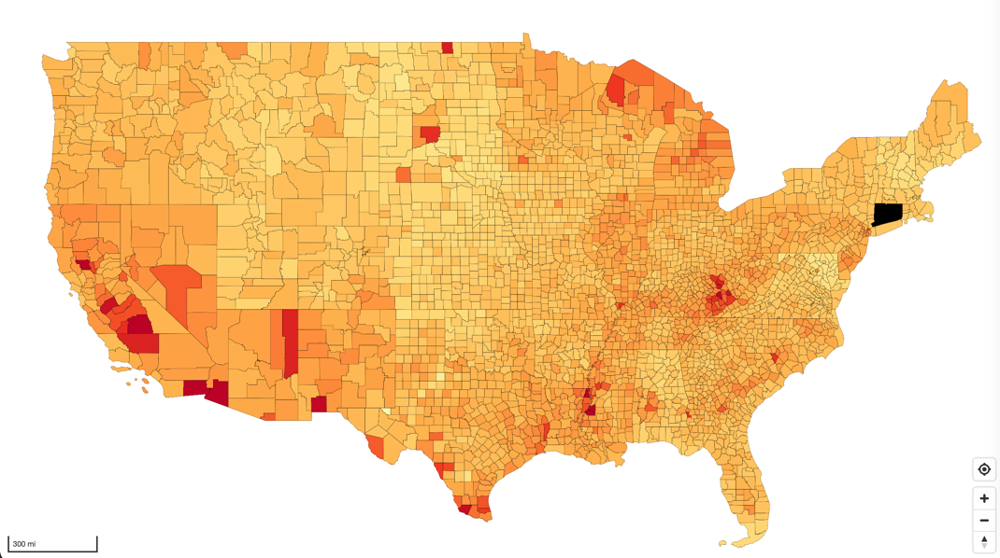

# Maplibre Chloropleth example



## Data Prep

Download county shapefile from here

https://www.census.gov/cgi-bin/geo/shapefiles/index.php?year=2022&layergroup=Counties+%28and+equivalent%29

Download BLS unemployment data from here

https://www.bls.gov/web/metro/laucntycur14.zip

see data/ folder for processing information

```bash
cd data

python -m venv venv

source venv/bin/activate

pip install -r requirements.txt

python process.py

tippecanoe -zg --drop-densest-as-needed -o us_counties_unemployment.pmtiles us_counties_unemployment.geojson

mv us_counties_unemployment.pmtiles ../tiles/.
```

## Up and running

```bash
npm install

npm run dev
```
